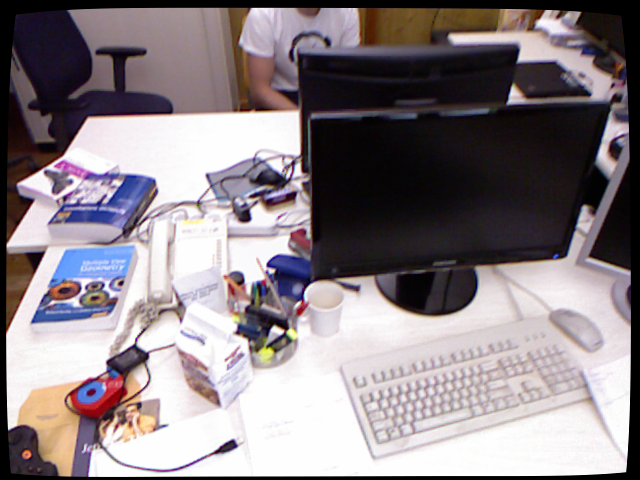
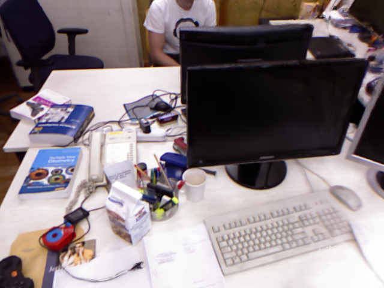
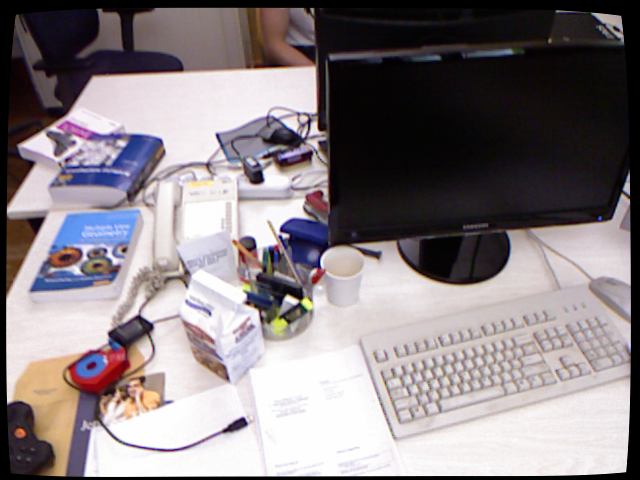
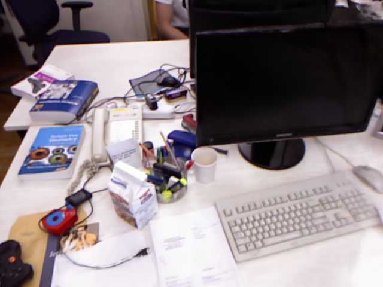
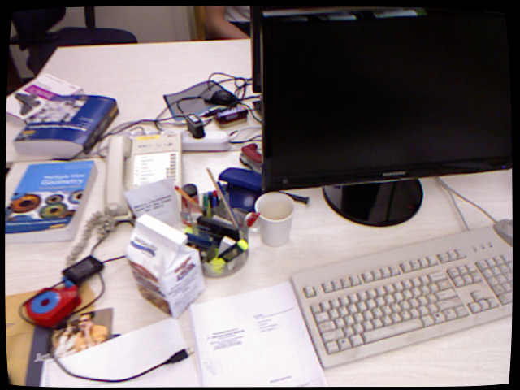
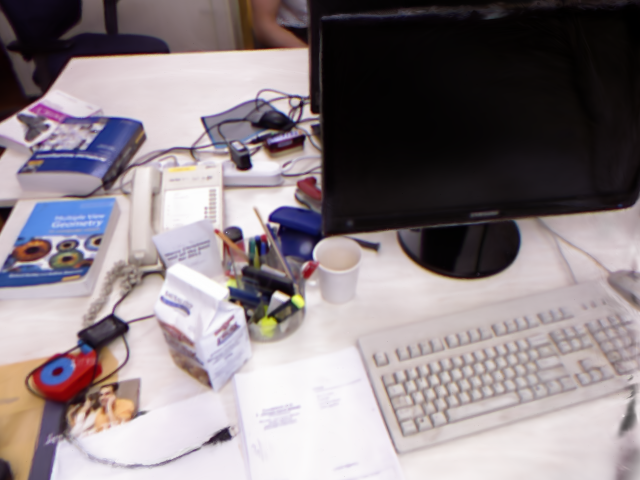
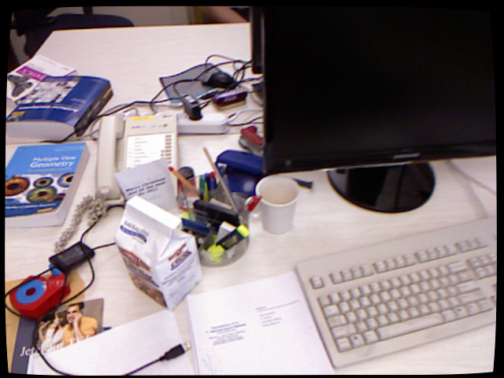
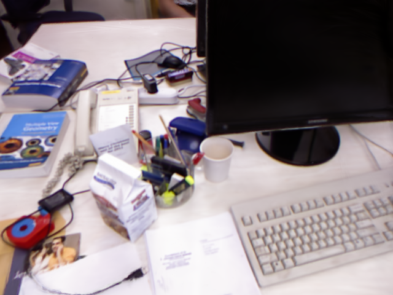

# Monocular Indoor Scene 3D Reconstruction

A four-stage pipeline that turns a single-camera indoor scene video into a
photorealistic 3D scene representation. The method is built around three pre-existing
components combined together:

| Component | Role |
|---|---|
| ORB-SLAM3 | Monocular visual SLAM — per-frame camera poses + sparse 3D map |
| MiDaS (DPT-Hybrid) | Monocular depth — dense per-frame disparity |
| gsplat | 3D Gaussian Splatting — photoreal scene representation |
| `Run_Init.py` | Pass 1 + Pass 2 driver (frame extraction, depth fusion) |
| `Run_Splat.py` | Pass 3 driver (Gaussian Splatting refinement) |

Validated on the TUM RGB-D `freiburg1/xyz` sequence; the same workflow
applies to any monocular indoor video given a calibrated camera.

---

## Results

Held-out novel views from the TUM `freiburg1/xyz` run, rendered from the
trained Gaussian Splatting model after 7000 iterations.

| GT | Ours (step 7000) |
|----|-------------------|
|   |   |
|   |   |
|  |  |
|  |  |

The point cloud, mesh, and `.ply` splat file produced by the same run are
not committed (the dense point cloud is ~400 MB) — rerun the pipeline to
regenerate them locally.

---

## Quickstart

```bash
git clone --recurse-submodules https://github.com/jalees018/Indoor-Scene-Reconstruction.git
cd Indoor-Scene-Reconstruction
./setup.sh                              # one-time: build deps + env
conda activate slam-recon
./run.sh path/to/scene.mp4 configs/MyVideo.yaml
```

End-to-end this produces, under `output_<video_basename>/`:

- `scene_pointcloud.ply` — dense colored point cloud
- `scene_mesh.ply` — Poisson mesh
- `splat/splats.ply` — Gaussian Splatting model (open in
  [SuperSplat](https://playcanvas.com/supersplat/editor))

Before running on your own video, **calibrate the camera and edit
`configs/MyVideo.yaml`** — see [Custom video](#custom-video) below.

---

## Pipeline Overview

1. **Pass 1a — frame extraction.** `run.sh` calls `Run_Init.py --extract-only` to turn `video.mp4` into TUM-style `rgb/*.png` plus a `rgb.txt` timestamp list.
2. **Pass 1b — visual SLAM.** `mono_tum` runs ORB-SLAM3 on the frames, writing `CameraTrajectory.txt` (per-frame poses) and `MapPoints.txt` (sparse 3D map).
3. **Pass 2 — dense depth + scale fit.** `Run_Init.py` runs MiDaS, fits an affine per frame against the SLAM landmarks, backprojects, and writes `scene_pointcloud.ply` + `scene_mesh.ply`.
4. **Pass 3 — Gaussian Splatting.** `Run_Splat.py` seeds gsplat from the point cloud and trains against the frames, producing `splats.ply`.

Each pass produces the prior the next pass needs:

- **Pass 1 → Pass 2**: SLAM poses define a consistent world frame; the
  sparse map provides anchor points for metric scale fitting.
- **Pass 2 → Pass 3**: the dense colored cloud seeds Gaussian positions
  and colors, vastly reducing the number of training iterations needed
  versus random initialization.

### Method Used

Method: The pipeline takes a monocular video and resolves the three things a single camera can't observe directly — geometry, depth scale, and appearance — in three sequential passes. ORB-SLAM3 first recovers camera trajectory and a sparse 3D map by tracking ORB features and running bundle adjustment.
MiDaS then predicts dense per-frame depth, which is only known up to an affine factor; we fit α·disp_midas + β per frame against the sparse SLAM landmarks projecting into that view, turning relative disparity into metric depth consistent with the SLAM world frame. Those scale-corrected depths are back-projected and fused into a colored point cloud, which seeds 3D Gaussian Splatting — the splats are then optimized by differentiable rendering against the input frames to recover sharp, view-dependent appearance.

 Why this composition:

 - Each component does one thing well, and the next one fixes its weakness. ORB-SLAM3 is reliable for poses but produces a sparse map. MiDaS gives dense depth but only relative. Gaussian Splatting needs both poses and a rough 3D init — random initialization needs ~30k   iterations and is unstable; seeding from a SLAM+MiDaS cloud converges photoreal in ~7k.
 - Avoids training anything from scratch. All three components are pretrained / classical, so the pipeline runs in ~30 minutes on one GPU instead of requiring a multi-day NeRF/3DGS-from-scratch fit.
 - Pure monocular — no LiDAR, no depth sensor, no IMU. Anyone with a phone camera can capture input.

The main tradeoff we accept is that the output is metric relative to the SLAM map, not in absolute meters — recovering true scale would require an external reference (known length, IMU, or stereo capture).
Monocular reconstruction is under-constrained at every stage. Each pass
removes one ambiguity:

| Stage | Resolves | Mechanism |
|---|---|---|
| ORB-SLAM3 | Camera trajectory + sparse structure | Feature tracking + bundle adjustment |
| MiDaS + scale fit | Per-pixel metric depth | Affine alignment to SLAM landmarks |
| Gaussian Splatting | View-dependent appearance, sharp detail | Differentiable rendering vs. input frames |


---

## Requirements

- **OS**: Linux (tested on Ubuntu 22.04).
- **GPU**: NVIDIA, CUDA 12.x capable (validated on L40S). 
- **Tools**: `conda` (Miniconda or Anaconda) in `PATH`.
- **System packages** (Ubuntu/Debian):

```bash
sudo apt-get install -y build-essential cmake git pkg-config \
    libeigen3-dev libopencv-dev libglew-dev libssl-dev \
    libboost-all-dev libpython3-dev python3-pip
```

`setup.sh` checks for these and exits early with the apt-get line if any
are missing.

---

## Running on a video

```bash
./run.sh <video> <calib.yaml> [options]
```

`run.sh --help` lists all flags. Common ones:

| Flag | Default | Purpose |
|---|---|---|
| `--out DIR` | `output_<basename>` | Output directory. |
| `--fps N` | 5 | Frame extraction rate. 5–10 Hz handheld; 2–4 Hz slow pans. |
| `--depth-max M` | 5.0 | Far-plane clamp (m). Lower for tight indoor scenes. |
| `--stride N` | 4 | Pass 2 pixel stride for backprojection. |
| `--iters N` | 7000 | Pass 3 training iterations. |
| `--image-scale S` | 1.0 | Pass 3 train-time downscale (use 2 on 1080p+). |
| `--skip-splat` | off | Stop after Pass 2 (no 3DGS). |
| `--skip-mesh` | off | Skip Poisson mesh in Pass 2. |
| `--resume` | off | Reuse existing frames / SLAM outputs if present. |

The environment must be activated first: `conda activate slam-recon`.

### Output layout

```
output_<basename>/
├── rgb/*.png                       extracted frames (Pass 1a)
├── rgb.txt                         TUM frame index   (Pass 1a)
├── CameraTrajectory.txt            per-frame camera-to-world poses (Pass 1b)
├── KeyFrameTrajectory.txt          keyframe poses (sanity only)    (Pass 1b)
├── MapPoints.txt                   sparse 3D world-frame landmarks (Pass 1b)
├── scene_pointcloud.ply            dense fused cloud (Pass 2)
├── scene_mesh.ply                  Poisson mesh      (Pass 2)
└── splat/
    ├── splats.ply                  Gaussian model           (Pass 3)
    └── eval/
        ├── step*_view*.png         per-checkpoint renders   (Pass 3)
        └── gt_view*.png            ground-truth held-out frames
```

---

## Custom video

```bash
./run.sh my_scene.mp4 configs/MyCam.yaml --fps 7
```

A quick sanity check after Pass 1b: the number of lines in
`output_*/CameraTrajectory.txt` should be close to the number of
extracted frames. A much smaller count means tracking was lost mid-video
— typically a calibration or motion issue.

---

## Validating on TUM fr1/xyz

1. Download the dataset:

   ```bash
   mkdir -p Data/RGBD && cd Data/RGBD
   wget https://cvg.cit.tum.de/rgbd/dataset/freiburg1/rgbd_dataset_freiburg1_xyz.tgz
   tar -xzf rgbd_dataset_freiburg1_xyz.tgz
   cd ../..
   ```

2. Run the pipeline against the already-extracted TUM frames (no video):

   ```bash
   # Pass 1b
   pushd Data/RGBD/rgbd_dataset_freiburg1_xyz
   "$PWD/../../../ORB_SLAM3/Examples/Monocular/mono_tum" \
       "$PWD/../../../ORB_SLAM3/Vocabulary/ORBvoc.txt" \
       "$PWD/../../../ORB_SLAM3/Examples/Monocular/TUM1.yaml" \
       "$PWD"
   popd

   # Pass 2
   python Run_Init.py \
       --frames-dir Data/RGBD/rgbd_dataset_freiburg1_xyz \
       --trajectory Data/RGBD/rgbd_dataset_freiburg1_xyz/CameraTrajectory.txt \
       --map-points Data/RGBD/rgbd_dataset_freiburg1_xyz/MapPoints.txt \
       --calib      ORB_SLAM3/Examples/Monocular/TUM1.yaml \
       --pose-tol   0.005 \
       --out        output_tum_xyz

   # Pass 3
   python Run_Splat.py \
       --frames-dir Data/RGBD/rgbd_dataset_freiburg1_xyz \
       --trajectory Data/RGBD/rgbd_dataset_freiburg1_xyz/CameraTrajectory.txt \
       --calib      ORB_SLAM3/Examples/Monocular/TUM1.yaml \
       --init-cloud output_tum_xyz/scene_pointcloud.ply \
       --out        output_tum_xyz/splat \
       --voxel-size 0.02 --iters 7000
   ```

   We use `--frames-dir` (not `--video`) because the TUM dataset already
   ships with `rgb/` + `rgb.txt`, and its timestamps must be preserved
   so they line up with the SLAM trajectory.

Expected on fr1/xyz: 798 frames, ~52–59 keyframes, ~3400–3600 map
points, ~796 per-frame poses, `Backprojected 796 frames; skipped 2 (no
pose); 0 fell back to heuristic depth.` in Pass 2.

Approximate runtimes on L40S:

| Stage | Time |
|---|---|
| Pass 1b (ORB-SLAM3) | ~30 s |
| Pass 2 (MiDaS + fusion) | ~3 min |
| Pass 2 (Poisson mesh on 15M pts) | ~10 min |
| Pass 3 (3DGS, 7000 iters, with densification) | ~25 min |

---

## Patches to ORB-SLAM3

Three upstream changes are required, all captured in
`patches/orbslam3.patch` and applied automatically by `setup.sh`:

1. **`Examples/Monocular/mono_tum.cc`** — viewer disabled (headless
   compatibility), and three trajectory / map outputs are saved on
   shutdown: `KeyFrameTrajectory.txt`, `CameraTrajectory.txt`,
   `MapPoints.txt`.

2. **`src/System.cc::SaveTrajectoryTUM`** — upstream early-returns for
   monocular sensors. The relative-pose accumulation underneath works
   correctly for monocular, so the guard has been removed. This is what
   enables per-frame (not keyframe-only) pose export, which is the key
   correctness fix for Pass 2.

3. **`src/System.cc::SaveMapPoints` (new)** — dumps the active map's
   world-frame landmarks as `x y z` text. Pass 2 reads this for scale
   alignment.

If you rebuild ORB-SLAM3 outside `setup.sh`, do not skip these patches
— without `CameraTrajectory.txt`, Pass 2 falls back to keyframe-only
poses and produces visible ghost-layer / smearing artifacts in the
dense cloud.

The patch also contains a few build-only changes (CMake 3.5+, C++14,
OpenCV 4 constant renames) so the codebase compiles on modern toolchains.

---

## Limitations

1. **Up-to-scale only.** Monocular SLAM cannot recover absolute metrics
   without an external reference.
2. **Initialization requires parallax.** Pure rotation at the start of
   the video will prevent ORB-SLAM3 from initializing the map.
3. **Calibration sensitivity.** Errors in intrinsics propagate through
   all three passes. Distortion is corrected in Pass 3 (via
   `cv2.undistort`) but not in Pass 2's backprojection.
4. **Loop closures change the map.** If ORB-SLAM3 closes a loop late in
   the sequence, the map is re-optimized; earlier-published landmark
   positions in `MapPoints.txt` reflect the final, post-closure state.
5. **No occlusion handling in Pass 2.** Dense MiDaS depth maps are fused
   without per-frame visibility reasoning, so dynamic objects or thin
   structures may appear duplicated. Pass 3 typically cleans this up
   during optimization.

---

## License

GPL-3.0, inherited from ORB-SLAM3. See `LICENSE` and `NOTICE` for
per-component licenses.
